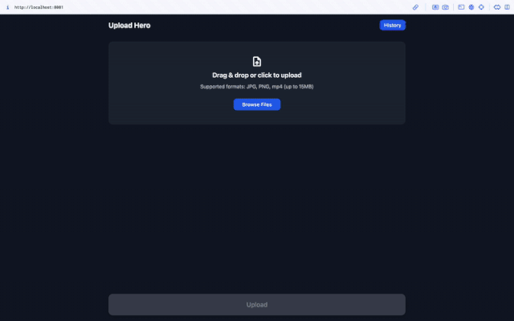
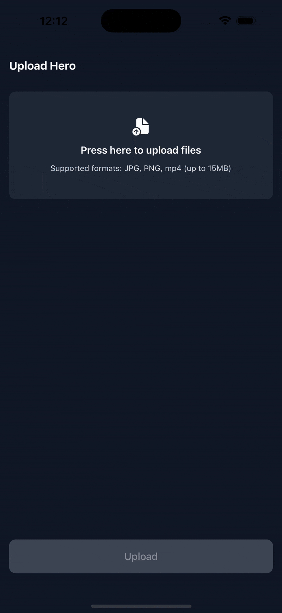

# 📤 Upload Hero

A cross-platform media file upload system supporting both **Web** and **React Native mobile platforms**, with robust, resumable, and concurrent chunked upload handling.

---


---

## 📸 Demo

### Web Upload Flow  


### Mobile Upload Flow  


*Note: Same core functionality on both Android & iOS. Demonstration shown here on iOS.*

---


## 🚀 Features

- 📁 **File Picker** with multi-select, file type filtering, and instant validation
- 🔄 **Chunked Uploads** (1MB chunks) with **max 3 concurrent uploads**
- ⏸️ **Pause, Resume, and Cancel** individual uploads
- 📊 Real-time **progress tracking** (per file + overall)
- 📣 **User feedback** for upload status, errors, and completion
- 🔁 **Automatic retries** with exponential backoff (max 3 retries)
- 💾 Local upload state persistence for resumable uploads
- 🌐 **React Web:** Drag-and-drop support, responsive layout, and local storage for upload history
- 📱 **React Native Mobile:** Native file picker, direct camera upload, and permission management
- 📡 **Node.js Server:** Chunk reception, validation, deduplication, and file reassembly

---

## 📡 API Endpoints

| Method | Endpoint                    | Description                              |
|:--------|:------------------------------|:-------------------------------------------|
| `POST`   | `/upload/initiate`             | Initiate upload session, pre-check file    |
| `POST`   | `/upload/chunk`                | Upload a file chunk                        |
| `POST`   | `/upload/finalize`             | Finalize upload and reassemble file        |
| `GET`    | `/upload/status/:uploadId`     | Retrieve current upload status             |

---

## ✅ Setup & Run

### 🖥️ Server
```bash
cd backend
npm install
npm start
```

### 🌍 Web
```bash
cd frontend
npm install
npm start
```
Press w to open in the browser

### 📱 Mobile
```bash
cd frontend
npm install
npm start
```
To run on devices:

- Press i for iOS
- Press a for Android

**Note**: For Mobile you will need a physical device or simulator connected with **Expo Go** Installed.


## 📝 Project Notes
- ⚠️ **Android background uploads** remain in progress due to time constraints.
- ✅ Prioritised **stability**, **concurrency handling**, and **resumable uploads**.
- 🚀 Built with **cross-platform scalability** in mind.

---

## 👤 Author
- **Name**: Joe Ulyatt
- 🔗 [**LinkedIn**](https://www.linkedin.com/in/joewhocodes)
- 🐙 [**GitHub**](https://github.com/JoeDareZone)

---

## 📜 License
This project is licensed under the **MIT License**.
